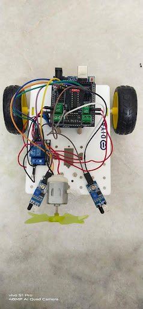

# 🔥 Fire Combat Robot

## Internship Project

## Project Description
The **Fire Combat Robot** is an autonomous robotic system designed to detect and control fire with minimal human intervention. The robot uses **IR sensors** to identify the presence of fire and navigate toward the source. Once fire is detected, a **fan-based extinguishing mechanism** is activated to suppress the flames.

The system is controlled by an **Arduino UNO**, which processes sensor inputs and manages motor movement and fire-extinguishing actions through a motor driver and relay module. This project demonstrates practical implementation of **embedded systems, sensor interfacing, and motor control**, with potential applications in fire safety and automation.

---

## Aim
To build a fire combat robot that can automatically detect fire and extinguish it by activating a fan mechanism, while navigating toward the fire source using sensors.

---

## Working Principle
1. IR sensors continuously monitor the environment for fire.
2. When fire is detected, the robot stops moving.
3. The fan is activated using a relay module to extinguish the fire.
4. If no fire is detected, the robot continues to move forward.

---

## Components Required
- Arduino UNO  
- IR Sensors (2)  
- BO Motors (2)  
- Wheels (2)  
- DC Motor (Fan)  
- Small Fan  
- Motor Driver  
- Relay Module  
- BO Motor Clamp  
- Castor Wheel  
- 9V Battery  
- Battery Snapper  
- Jumper Wires (Male–Male, Male–Female, Female–Female)  
- Plastic Clamp  
- Brass Screws (M3x10mm, M3x25mm, M3x30mm)  
- M3 Nuts  
- USB Cable  

---

## 🖼️ Project Images

### Robot Setup

### Block Diagram

*(Images are added for reference and demonstration purposes.)*

---

## Skills Gained
- Arduino Programming (Embedded C)
- Sensor Interfacing
- Motor Control using Motor Driver
- Relay Module Control
- Hardware Assembly and Debugging

---

## Future Enhancements
- Adding a water pump mechanism
- Obstacle avoidance using ultrasonic sensors
- Remote monitoring using IoT
- Improved fire detection accuracy

---

## 👩‍💻 Author
**Damini M.K**  
Internship Project – Fire Combat Robot
